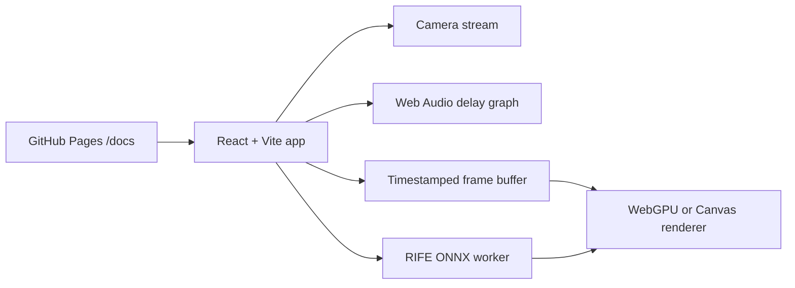

# Slow-motion Reality

Live site: https://baditaflorin.github.io/slow-motion-reality/

Browser-based slow-motion camera and audio experience using WebGPU, RIFE ONNX, and buffered Web Audio.

Slow-motion Reality turns a live camera stream into a one-quarter-speed perceptual field. It runs locally in the browser, buffers frames in memory, renders with WebGPU when available, falls back to Canvas, and lets advanced users load a compatible RIFE ONNX model for experimental interpolation.

## Quickstart

```sh
npm install
make install-hooks
make dev
make build
make smoke
```

## What v0.1.0 Does

- Requests camera and microphone only after the user presses Start.
- Buffers camera frames and plays them back at 4x slow-motion.
- Renders a liquid, heavy visual field through WebGPU with Canvas fallback.
- Mixes live and delayed microphone monitoring through Web Audio.
- Loads optional local RIFE ONNX models in a Web Worker via ONNX Runtime Web.
- Ships as a Mode A static GitHub Pages app with no backend and no analytics.

## Architecture



## Commands

```sh
make help
make dev
make build
make test
make smoke
make pages-preview
make lint
make fmt
```

## Documentation

Architecture: https://github.com/baditaflorin/slow-motion-reality/blob/main/docs/architecture.md

Deployment: https://github.com/baditaflorin/slow-motion-reality/blob/main/docs/deploy.md

Privacy: https://github.com/baditaflorin/slow-motion-reality/blob/main/docs/privacy.md

ADRs: https://github.com/baditaflorin/slow-motion-reality/tree/main/docs/adr

## Notes

GitHub Pages cannot set custom COOP/COEP headers. The app therefore treats ONNX/WebGPU acceleration as progressive enhancement and keeps the core camera buffer renderer usable without server headers.
