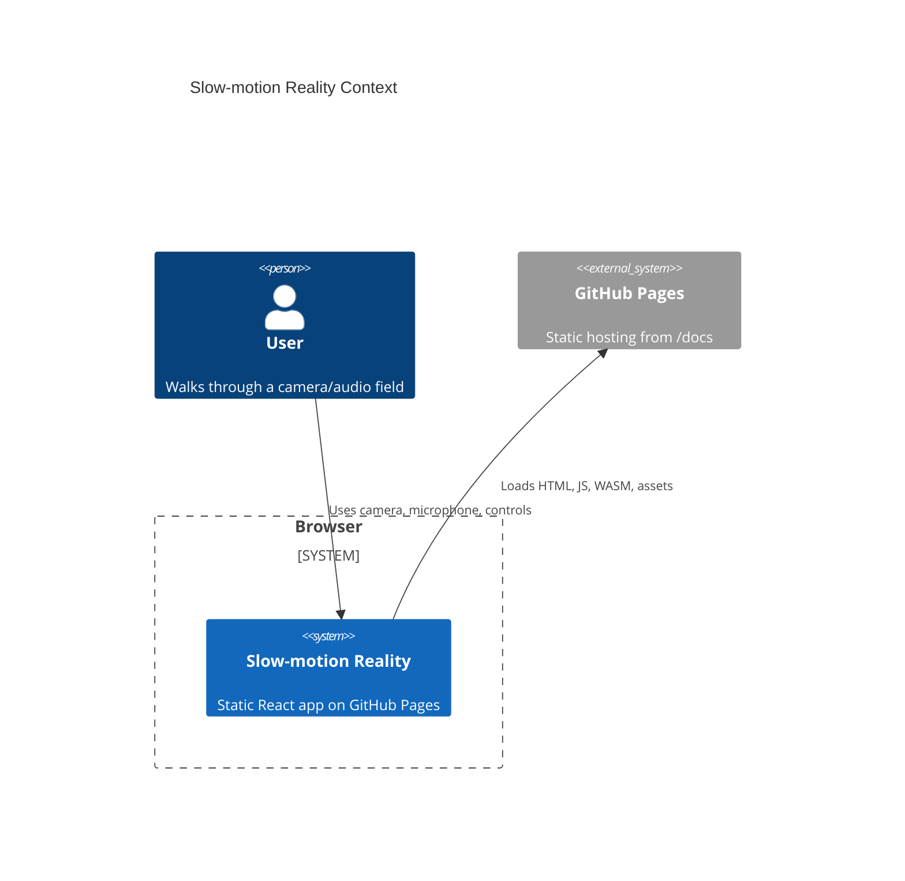
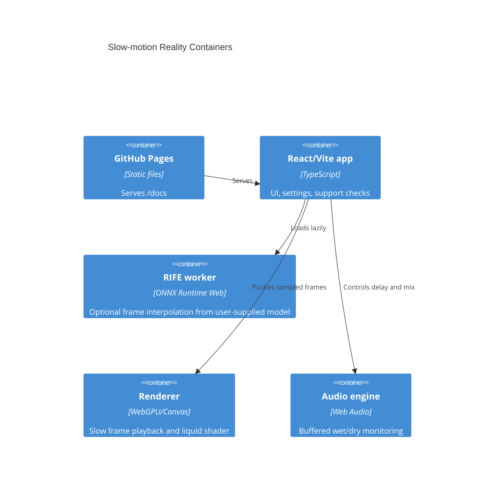

# Architecture

```mermaid
C4Context
title Slow-motion Reality Context
Person(user, "User", "Walks through a camera/audio field")
System_Boundary(browser, "Browser") {
  System(app, "Slow-motion Reality", "Static React app on GitHub Pages")
}
System_Ext(pages, "GitHub Pages", "Static hosting from /docs")
Rel(user, app, "Uses camera, microphone, controls")
Rel(app, pages, "Loads HTML, JS, WASM, assets")
```

```mermaid
C4Container
title Slow-motion Reality Containers
Container(pages, "GitHub Pages", "Static files", "Serves /docs")
Container(spa, "React/Vite app", "TypeScript", "UI, settings, support checks")
Container(worker, "RIFE worker", "ONNX Runtime Web", "Optional frame interpolation from user-supplied model")
Container(renderer, "Renderer", "WebGPU/Canvas", "Slow frame playback and liquid shader")
Container(audio, "Audio engine", "Web Audio", "Buffered wet/dry monitoring")
Rel(pages, spa, "Serves")
Rel(spa, worker, "Loads lazily")
Rel(spa, renderer, "Pushes sampled frames")
Rel(spa, audio, "Controls delay and mix")
```
